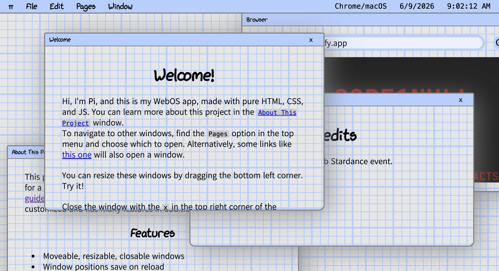
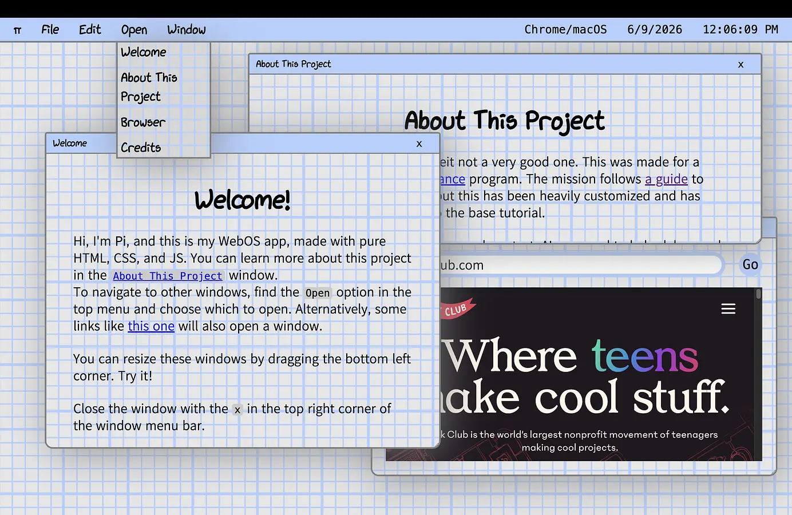

# Pi WebOS

[This project](https://pi-os-mission.netlify.app/) is a paper-themed WebOS, a website that mimics the look and feel of an OS (somewhere between a stripped down Windows and MacOS).

 

### **[Try it here!](https://pi-os-mission.netlify.app/)**

## About

This was made for a mission as part of the [Stardance](https://stardance.hackclub.com/home) program. The mission follows [a guide](https://jams.hackclub.com/batch/webOS/) to creating your own WebOS, but this has been heavily customized and has many features in addition to the base tutorial.

## Features
* Moveable, resizable, closable windows
* Window positions save on reload
* Correct Z ordering after opening a page
* Draggable files/apps on desktop
* Double click menu bar to fullscreen window
* Window cannot leave desktop
* Window snaps back into frame
* Multiple Apps
    * Text Documents (like this one!)
    * (Mostly) Functional Browser
    * Notes App
    * Settings App
* Menu bar
* Page Selector
* Fullscreen OS
* Browser/OS detection
* Links that open windows in the OS
* Keyboard shortcuts (Esc, Shift + Esc, Cmd + Z)
* Customizable themes through the Settings app

## Notes

There is a (mostly) working browser in this OS! It (suprisingly) was not too difficult. It is mostly just a text box and an iframe. Because of that, however, it means that many popular sites do not work. Many websites intentionally disable being shown in an iframe for various reasons. However, there are many sites that you can visit! Also, sometimes dragging to resize a window over the browser page can intercept your click and stop the resize. 

## AI Usage

No AI was used to generate any code or text. AI was used to help debug and research. 

## Credits

This is a project for the Hackclub Stardance event.

[Mission](https://jams.hackclub.com/batch/webOS/part-4)
[Hack Club](https://hackclub.com)
[xkcd Font](https://github.com/ipython/xkcd-font)